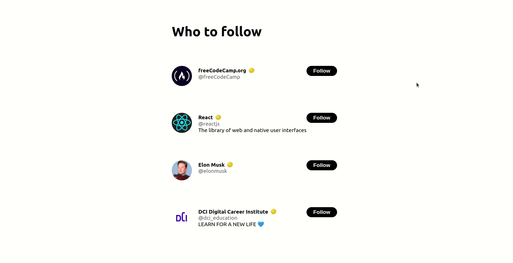

# Exercise :cartwheeling: useEffect 

### Twitter feature

The tech team at Twitter has introduced some new features.

Unfortunately the "who to follow suggestions" for the users stopped working since the last update.

Elon has assigned a ticket to you to rewrite the frontend code for this part of the program.

-----------------------------------------------------------------
**:eye_speech_bubble: hint**

For the avatar use the following code as src attribute for the img
```javascript
  src={`https://unavatar.io/twitter/${userName}`}
```



---

**use the following example data**

```javascript
const users = [
  {
    id: '6e432e18-0ec8-11ee-be56-0242ac120002',
    userName: 'freeCodeCamp',
    name: 'freeCodeCamp.org',
    isFollowing: false,
  },
  {
    id: '6e433110-0ec8-11ee-be56-0242ac120002',
    userName: 'reactjs',
    name: 'React',
    bio: 'The library of web and native user interfaces',
    isFollowing: true
  },
  {
    id: '6e433692-0ec8-11ee-be56-0242ac120002',
    userName: 'elonmusk',
    name: 'Elon Musk',
    isFollowing: false
  },
  {
    id: 'b5282b44-0ec8-11ee-be56-0242ac120002',
    userName: 'dci_education',
    name: 'DCI Digital Career Institute',
    bio: 'LEARN FOR A NEW LIFE 💙',
    isFollowing: true
  }
]
```

---

### Happy Coding! 
